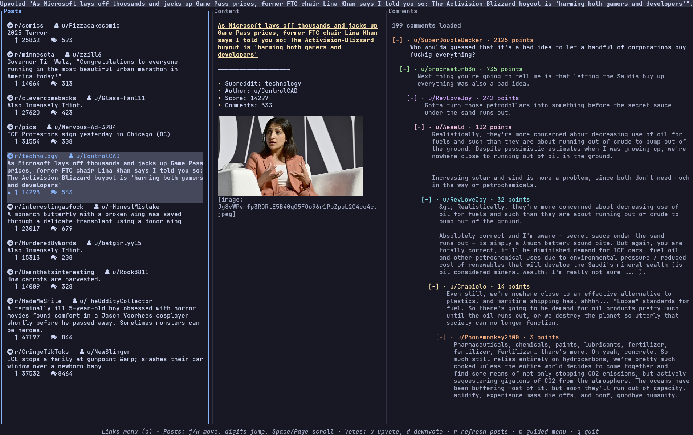

# Reddix

[](https://github.com/ck-zhang/reddix/releases/latest)
[](LICENSE)

Reddix - Reddit, refined for the terminal.



## Features

- image preview based on kitty graphics protocol
- video playback through mpv's Kitty integration
- multi-account support
- keyboard first navigation
- smart caching
- NSFW filter toggle

## Install

Download the latest [release](https://github.com/ck-zhang/reddix/releases/latest) from GitHub or run one of the installers

```sh
curl --proto '=https' --tlsv1.2 -LsSf https://github.com/ck-zhang/reddix/releases/latest/download/reddix-installer.sh | sh
```

## Quickstart
1. Create a Reddit “script” at https://www.reddit.com/prefs/apps and set the redirect URI to `http://127.0.0.1:65010/reddix/callback`.
2. Launch `reddix`, press `m`, and follow the guided menu for setup.
3. Prefer to configure things manually? Copy [`docs/examples/config.yaml`](docs/examples/config.yaml) into `~/.config/reddix/config.yaml` and fill in your credentials.

Core shortcuts: `j/k` move, `h/l` change panes, `m` guided menu, `o` action menu, `r` refresh, `s` sync subs, `u/d` vote, `q` quit.

## Support
- Feature requests and contributions are welcome, this project is in its very early stage.
- Track ongoing ideas in the [feature request log](docs/feature-requests.md).
- Donation: https://ko-fi.com/ckzhang
